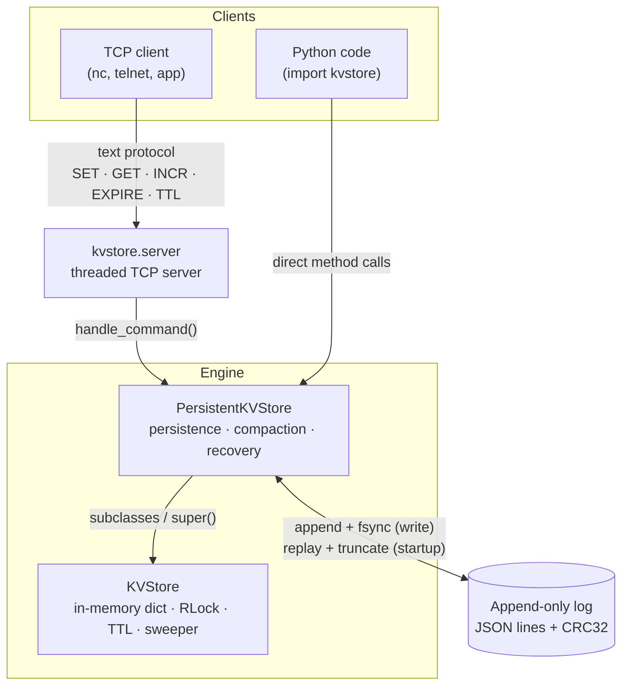

# kv_store

A small but real key-value store written from scratch in Python — a single-node,
log-structured store in the spirit of Redis (AOF) and Bitcask. It can be used as an
embedded library or run as a network server speaking a simple text protocol.

It provides durable writes (append-only log with `fsync` + checksums), crash-safe
recovery, thread-safe concurrent access, key expiry (TTL), and self-maintaining log
compaction.

## Features

- **In-memory core** — `get` / `set` / `delete` / `exists` / `keys`, plus atomic `incr`.
- **Durable persistence** — every write is appended to a log and `fsync`ed to disk before returning.
- **Crash-safe recovery** — each record carries a CRC32 checksum; on startup the log is replayed, and a corrupt/torn tail is detected and truncated rather than crashing recovery.
- **TTL / expiry** — per-key time-to-live, expired lazily (on access) *and* actively (a background sweeper). TTLs survive restarts.
- **Log compaction** — the append-only log is rewritten to one record per live key, both on demand (`compact()`) and automatically as it grows.
- **Thread-safe** — a single re-entrant lock guards all state; the server handles each client on its own thread.
- **Network server** — a threaded TCP server with a line-based text protocol (`SET`, `GET`, `DEL`, `EXISTS`, `INCR`, `EXPIRE`, `TTL`).

## Architecture



- **`KVStore`** holds all data in an in-memory dict, guarded by a re-entrant lock, and
  owns TTL/expiry (lazy + a background sweeper).
- **`PersistentKVStore`** subclasses it and layers on the append-only log: every write is
  logged and `fsync`ed, startup replays (and repairs) the log, and compaction keeps it small.
- **`kvstore.server`** is a thin threaded TCP front-end that translates text commands into
  method calls — the store itself has no networking code.

## Requirements

- Python **3.10+** (uses modern type-hint syntax)

## Install

```bash
python3 -m venv .venv
./.venv/bin/pip install -e ".[dev]"
```

## Quick start (as a library)

```python
from kvstore import KVStore, PersistentKVStore

# In-memory only
store = KVStore()
store.set("name", "aditya")
store.get("name")            # -> "aditya"
store.incr("visits")         # -> 1  (atomic)
store.set("otp", "123456", ttl=30)   # expires in 30 seconds

# Durable: writes are logged to disk and replayed on the next open
db = PersistentKVStore("data.log")
db.set("name", "aditya")
# ...restart the process...
db = PersistentKVStore("data.log")
db.get("name")               # -> "aditya"
```

## Python API

### `KVStore` (in-memory)

| Method | Description |
| --- | --- |
| `set(key, value, ttl=None)` | Store `value`; optional `ttl` (seconds). A plain `set` clears any existing TTL. |
| `get(key) -> str` | Return the value; raises `KeyNotFoundError` if missing/expired. |
| `delete(key)` | Remove the key; raises `KeyNotFoundError` if missing. |
| `exists(key) -> bool` | Whether the key is present (and not expired). |
| `keys() -> list[str]` | All current keys. |
| `len(store) -> int` | Number of keys. |
| `incr(key, amount=1) -> int` | Atomically add to an integer value (starts at 0); returns the new value. |
| `expire(key, seconds) -> bool` | Attach/replace a TTL on an existing key; `False` if the key is absent. |
| `ttl(key) -> float \| None` | Seconds remaining; `None` if the key has no TTL; raises `KeyNotFoundError` if missing. |
| `start_expiry_sweeper(interval=1.0)` | Start the background thread that actively evicts expired keys. |
| `stop_expiry_sweeper()` | Stop the sweeper thread. |

`KeyNotFoundError` (a subclass of `KeyError`) is raised for missing keys and carries a
`.key` attribute.

### `PersistentKVStore(path, auto_compact_threshold=1000)`

Subclasses `KVStore` and adds durability. Same API as above, plus:

| Method | Description |
| --- | --- |
| `compact()` | Rewrite the log to one record per live key (drops overwrites, deletes, and expired keys). |

- `path` — the log file location.
- `auto_compact_threshold` — the log auto-compacts once its record count reaches `max(auto_compact_threshold, 2 × live_keys)`.

## Running the server

```bash
./.venv/bin/python -m kvstore.server
# kvstore listening on 127.0.0.1:6380 (Ctrl-C to stop)
```

Talk to it with any TCP client — one command per line:

```bash
nc 127.0.0.1 6380
```
```
SET session abc123
OK
INCR hits
VALUE 1
EXPIRE session 30
OK
TTL session
VALUE 30
GET session
VALUE abc123
QUIT
```

### Protocol

| Command | Reply |
| --- | --- |
| `SET <key> <value>` | `OK` (the value may contain spaces) |
| `GET <key>` | `VALUE <value>` · `NOT_FOUND` |
| `DEL <key>` | `OK` · `NOT_FOUND` |
| `EXISTS <key>` | `TRUE` · `FALSE` |
| `INCR <key> [amount]` | `VALUE <n>` |
| `EXPIRE <key> <seconds>` | `OK` · `NOT_FOUND` |
| `TTL <key>` | `VALUE <seconds>` · `VALUE -1` (no TTL) · `NOT_FOUND` |
| `QUIT` | closes the connection |

Errors are returned as `ERROR ...` lines (e.g. `ERROR unknown command: FOO`,
`ERROR usage: SET <key> <value>`, `ERROR value is not a number: abc`).

## On-disk format

The log is newline-delimited JSON — one operation per line, each with a `crc` checksum:

```json
{"op": "set", "key": "name", "value": "aditya", "crc": 3106870779}
{"op": "set", "key": "otp", "value": "123456", "expiry": 1737800000.0, "crc": 812004123}
{"op": "delete", "key": "name", "crc": 244532901}
{"op": "expire", "key": "otp", "expiry": 1737800100.0, "crc": 99120043}
```

On startup the file is replayed top-to-bottom to rebuild state. Each record's checksum
is re-verified; the first record that fails to parse or checksum (a torn write from a
crash) and everything after it is truncated away.

## Design notes

- **Durability.** `set` / `delete` / `expire` append to the log and `fsync` before
  returning, so an acknowledged write is on disk. This is the safe (slower) end of the
  durability/throughput trade-off.
- **Concurrency.** All state is guarded by a single re-entrant lock (`threading.RLock`);
  compound operations like `incr` are atomic. The server is threaded, so many clients
  share one store safely.
- **Expiry.** *Lazy* expiration drops a key when it's next touched; the *active* sweeper
  reclaims keys nobody touches. Both are used, as in Redis.
- **Compaction.** The log only grows on writes; compaction rewrites it down to the live
  key set. It runs automatically once the log is roughly twice the compacted size.

## Development

```bash
./.venv/bin/pytest              # run the test suite
./.venv/bin/ruff check .        # lint
./.venv/bin/ruff format .       # format
./.venv/bin/mypy                # type-check

./.venv/bin/pre-commit install  # run all of the above automatically on git commit
```

## Known limitations

- **All data lives in memory**; the log provides durability, not a way to store more
  than fits in RAM. (Bitcask keeps values on disk and only an index in memory — this
  does not.)
- After compaction's atomic `os.replace`, the containing **directory is not `fsync`ed**,
  so the rename itself is not guaranteed durable across a power loss.
- **Single node, single process** — no replication, authentication, TLS, or multi-key
  transactions. Values are strings, and the text protocol can't carry newlines in a value.

## Roadmap

The next major direction is to evolve the storage engine from an append-only log into a
proper **LSM tree** (sorted memtable → SSTables → merging compaction → Bloom filters),
which is what enables ordered range scans and datasets larger than memory. That work is
planned as a separate implementation in **Go**.

## License

See [LICENSE](LICENSE).
